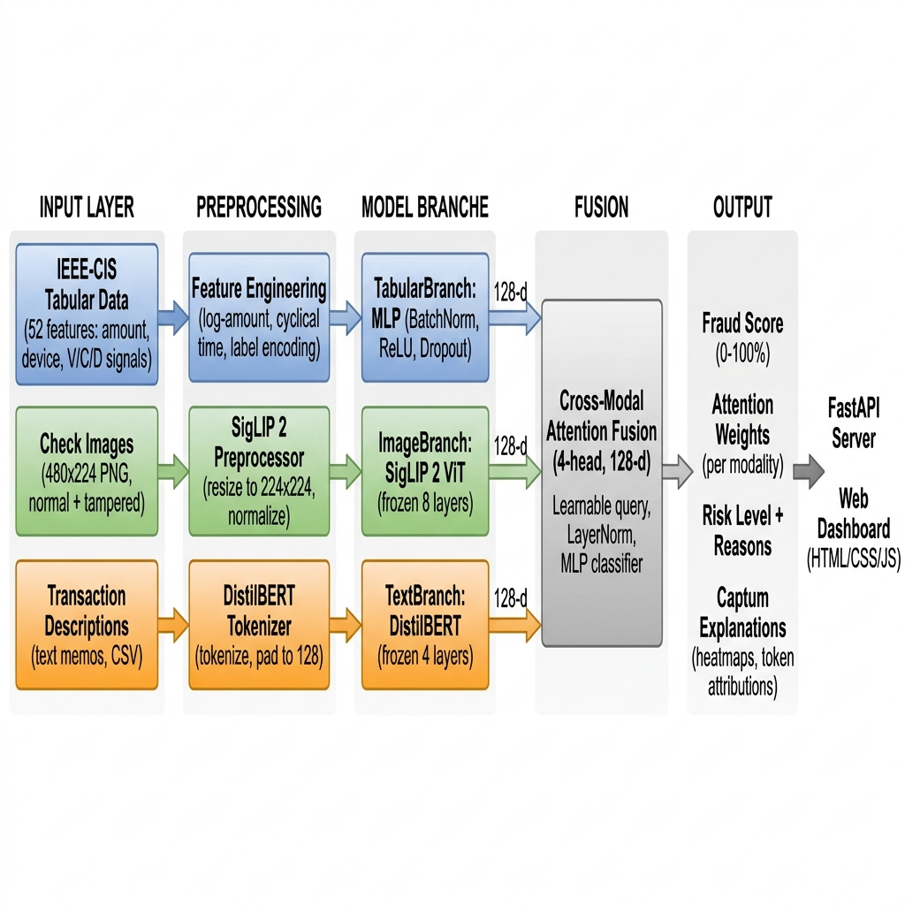

\begin{center}
\textbf{Course:} Advanced Deep Learning --- Spring 2026 \\
\textbf{Repository:} \url{https://github.com/harshalanilpatel/Multimodal-fraudlens}
\end{center}

\vspace{0.5em}
\hrule
\vspace{1em}

## a. Problem Context and Project Summary

Financial fraud costs the global economy over \$5 trillion annually, and existing rule-based or single-modality detection systems miss increasingly sophisticated attacks that span multiple data surfaces. **FraudLens** addresses this gap by building a multimodal fraud detection pipeline that simultaneously analyzes three complementary data modalities: structured transaction features (amounts, card metadata, device fingerprints), check document images (detecting visual tampering such as splicing, erasure, and font mismatches), and free-text transaction descriptions (identifying social-engineering language patterns).

These three modality-specific encoders --- a custom MLP for tabular data, Google's SigLIP 2 vision transformer for images, and DistilBERT for text --- each produce a 128-dimensional embedding that is fused through a **learned cross-modal attention mechanism**. This attention layer automatically discovers which modality is most informative for each transaction, producing a single fraud probability score (0--100\%) along with per-modality attention weights and Captum-powered integrated-gradient explanations. The system is served via a FastAPI inference server with an interactive web dashboard, giving fraud analysts an interpretable, real-time investigation tool.

---

## b. Dataset

### Primary Tabular Data

| Attribute | Detail |
|-----------|--------|
| **Source** | IEEE-CIS Fraud Detection (Kaggle) |
| **Type** | Tabular (CSV) |
| **Size** | ~590,000 transactions with 434 raw columns |
| **Fraud rate** | ~3.5\% (realistic class imbalance) |
| **Access** | Kaggle API or synthetic fallback |

After feature engineering, FraudLens uses **52 features** per transaction: log(amount), cyclical time-of-day, 7 numeric fields (card1--card5, addr1--addr2), 20 principal-component V-features, 10 counting C-features, 5 timedelta D-features, and 7 label-encoded categoricals (ProductCD, card4, card6, email domains, device type/info).

### Image Data

| Attribute | Detail |
|-----------|--------|
| **Source** | Synthetically generated check document images |
| **Type** | RGB PNG, 480 x 224 px |
| **Size** | 5,000 images (2,500 normal + 2,500 tampered) |
| **Artifacts** | Splicing, erasure/white-out, font mismatch, digit alteration |

Images are generated programmatically with realistic check templates (bank header, payee line, MICR code, amount box, signature scribble). Tampered variants introduce four artifact classes with visible but subtle visual differences.

### Text Data

| Attribute | Detail |
|-----------|--------|
| **Source** | Synthetically generated merchant memos |
| **Type** | CSV (TransactionID, description, label) |
| **Size** | 5,000 descriptions |
| **Normal** | Standard merchant memos (e.g., "Monthly subscription renewal --- CloudServe LLC") |
| **Fraud** | Social-engineering language (e.g., "URGENT wire transfer request. Send \$15,000 to account immediately.") |

### Preprocessing Challenges

- **Class imbalance:** Only ~3.5\% fraud --- addressed via Focal Loss ($\alpha$=0.75, $\gamma$=2.0)
- **Missing values:** 30\%+ NaN rate in IEEE-CIS V/C/D columns --- handled with zero-fill and indicator features
- **Modality alignment:** Synthetic image/text data must be aligned to tabular transaction IDs

### Ethical and Privacy Considerations

- IEEE-CIS data is pre-anonymized by Vesta Corporation (no personally identifiable information)
- All image and text data is fully synthetic --- no real check images or personal descriptions
- The system is designed for analyst assistance, not autonomous decision-making

---

## c. Planned Architecture

### Architecture Diagram

{ width=95% }

### Data Flow

```
Data Sources        Preprocessing          Model Branches        Fusion          Output
------------------------------------------------------------------------------------------
IEEE-CIS CSV  -> Feature Engineering  -> TabularBranch (MLP) -+
                  (log-amt, cyclical,    [256->128 + BN/ReLU] |
                   label encoding->52d)                       |
                                                              |
Check Images  -> SigLIP 2 Preprocess  -> ImageBranch (ViT)  --+-> Cross-Modal -> Fraud Score
  (480x224)      (resize 224, norm)     [frozen 8 layers]    |    Attention      (0-100%)
                                                              |    Fusion         Attn Wts
                                                              |    (4-head,128d)  Risk Level
Text Memos    -> DistilBERT Tokenizer -> TextBranch (BERT)  -+    + MLP Head     Captum Expl
                  (tokenize, pad 128)   [frozen 4 layers]                     -> FastAPI->UI
```

### Models and Frameworks

| Component | Architecture | Framework |
|-----------|-------------|-----------|
| Tabular encoder | 2-layer MLP (256 to 128) with BatchNorm, ReLU, Dropout(0.3) | PyTorch |
| Image encoder | SigLIP 2 ViT (base-patch16-224), 8 frozen layers, mean-pool | HF Transformers |
| Text encoder | DistilBERT (base-uncased), 4 frozen layers, [CLS] pooling | HF Transformers |
| Fusion | Multi-Head Cross-Attention (4 heads, learnable query, LayerNorm) | PyTorch |
| Loss | Focal Loss + auxiliary per-branch losses (weight 0.3) | Custom |
| Explainability | Integrated Gradients (pixel) + Layer IG (token) | Captum |
| Serving | FastAPI + Uvicorn | FastAPI |

### Training Pipeline

- **Optimizer:** AdamW (lr=$1 \times 10^{-4}$, weight\_decay=$1 \times 10^{-5}$)
- **Scheduler:** CosineAnnealingWarmRestarts ($T_0$=epochs/3, $T_{mult}$=2)
- **Mixed precision:** AMP with GradScaler (CUDA only)
- **Early stopping:** Patience=7 on AUPRC (preferred for imbalanced data)
- **Gradient clipping:** Max-norm 1.0

---

## d. User Interface Plan

### Interface Type

FraudLens uses a **custom web dashboard** served via FastAPI, built with vanilla HTML/CSS/JavaScript. It is a single-page application with a dark-theme glassmorphism design.

### Wireframe Mockup

{ width=85% }

### User Inputs

| Input | Type | Purpose |
|-------|------|---------|
| Transaction Amount | Number field | Dollar amount of the transaction |
| Product Code | Dropdown (W/H/C/S/R) | Transaction product category |
| Card Type | Dropdown | Card network (Visa, Mastercard, etc.) |
| Card Category | Dropdown | Debit / Credit / Charge |
| Email Domain | Dropdown | Purchaser's email provider |
| Device Type | Dropdown | Desktop / Mobile |
| Description | Textarea | Free-text transaction memo |
| Check Image | Drag-and-drop upload | Optional check document image |

### Outputs and Feedback

| Output | Visualization | Purpose |
|--------|--------------|---------|
| Fraud Score | Animated circular gauge (0--100\%) | Primary risk indicator |
| Risk Level | Color-coded badge (Low/Med/High/Critical) | Quick triage signal |
| Attention Weights | Three horizontal progress bars | Which modality drove the decision |
| Branch Scores | Three score cards with icons | Per-modality fraud signals |
| Risk Reasons | Bulleted natural-language list | Why the score is elevated |
| Image Heatmap | Captum IG overlay on original image | Suspicious image regions |
| Text Highlighting | Inline token highlighting (red = suspicious) | Which words triggered the text branch |
| Raw JSON | Expandable JSON viewer | Full API response for debugging |

### How the UI Enhances Usability

1. **Interpretability:** Attention weights and Captum explanations let analysts understand *why* a transaction was flagged
2. **Multimodal insight:** Side-by-side display of tabular, image, and text signals gives a holistic view
3. **Speed:** Single-click analysis with live-updating gauge animation reduces investigation time
4. **Trust:** Token-level and pixel-level attributions build confidence in model decisions

---

## e. Innovation and Anticipated Challenges

### What Makes FraudLens Unique

1. **Learned cross-modal attention fusion:** Rather than simple score averaging or concatenation, FraudLens uses a learnable query vector that cross-attends to all three modality embeddings, discovering which combination is most informative *per transaction*.

2. **Deep multimodal explainability:** Captum Integrated Gradients are applied across modalities --- pixel-level heatmaps for images and token-level attributions for text --- giving analysts granular insight beyond attention weights alone.

3. **Check document image analysis:** Applying a SigLIP 2 vision transformer to synthetic check documents for visual tampering detection is a novel application of a cutting-edge Google model.

### Key Technical Risks

| Risk | Impact | Mitigation |
|------|--------|------------|
| **Modality dominance** -- tabular branch may overpower image/text | Fusion degrades to single-modality | Auxiliary per-branch losses (wt=0.3) provide independent gradient signal; monitor per-branch AUPRC; apply modality dropout if needed |
| **Synthetic data gap** -- models trained on synthetic images/text may not generalize | Poor real-world transfer | Design artifacts with realistic noise; plan transfer-learning on real samples; evaluate with held-out synthetic data |
| **Compute constraints** -- approx 160M parameters across SigLIP2 + DistilBERT + MLP | Slow training iteration | Freeze early layers (8/12 SigLIP, 4/6 BERT); mixed-precision; --sample-size flag for rapid dev |

---

## f. Implementation Timeline

| Week | Dates | Focus | Expected Outcome |
|------|-------|-------|-------------------|
| 1 | Apr 1--5 | Data cleaning, baseline setup | Working data loaders, `setup.ipynb` with exploration plots, synthetic data pipeline |
| 2 | Apr 5--12 | Baseline training, UI prototype | Model trains end-to-end with Focal Loss, FastAPI dashboard serves predictions, TensorBoard |
| 3 | Apr 12--19 | Model tuning, interpretability | Improved AUPRC via hyperparameter sweep, Captum integrated (heatmaps + text), per-branch analysis |
| 4 | Apr 19--26 | Interface integration, demo | Dashboard connected to real inference, Gradio alt, batch mode, Docker verified |
| 5 | Apr 26--29 | Final report, presentation | Completed report, all tests passing, presentation materials ready |

---

## g. Responsible AI Reflection

### Fairness

Financial fraud models can encode correlations between fraud and geographic, demographic, or socioeconomic features (e.g., email domain, device type). FraudLens should be audited for disparate impact across protected groups before deployment. The system is designed as an *analyst assistance tool*, not an autonomous decision-maker --- final fraud determinations remain with human reviewers.

### Transparency

Explainability is built into the architecture by design: attention weights, per-branch scores, risk reasons, pixel-level heatmaps, and token-level attributions ensure every prediction is interpretable. This directly supports regulatory requirements (e.g., ECOA, FCRA) for explainable credit decisions. All model weights, training code, and configurations are version-controlled and reproducible.

### Environmental Considerations

Training a ~160M parameter model requires meaningful GPU resources. We mitigate by freezing ~60\% of parameters (transfer learning), using mixed-precision ($\text{FP16}$), and supporting early stopping to avoid unnecessary epochs. The FastAPI server supports single-sample inference on CPU, and the Docker image uses a slim Python base to minimize resource consumption.

### Data Privacy

All training data is either anonymized (IEEE-CIS) or fully synthetic (images, text). No personally identifiable information is used at any stage of development or deployment.
